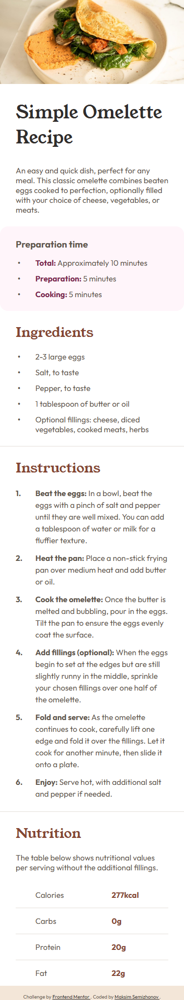
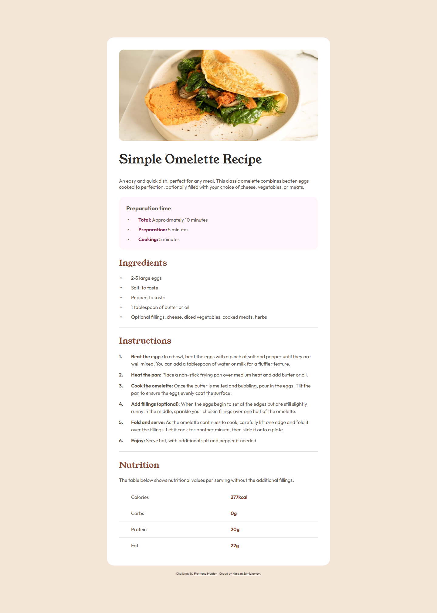

# Frontend Mentor - Recipe page solution

This is a solution to the [Recipe page challenge on Frontend Mentor](https://www.frontendmentor.io/challenges/recipe-page-KiTsR8QQKm). 

## Table of contents

- [Overview](#overview)
  - [The challenge](#the-challenge)
  - [Screenshot](#screenshot)
  - [Links](#links)
- [My process](#my-process)
  - [Built with](#built-with)
  - [What I learned](#what-i-learned)
  - [Continued development](#continued-development)
- [Author](#author)

## Overview

### Screenshot
<table>
    <tr>
        <th>Mobile (375px)</th>
        <th>Desktop (1440px)</th>
    </tr>
    <tr>
        <td></td>
        <td></td>
    </tr>
</table>

### Links

- Solution URL: [GitHub Repository](https://github.com/incmoga/recipe-page-main)
- Live Site URL: [Live Demo](https://incmoga.github.io/recipe-page-main/)

## My process

### Built with

- Semantic HTML5 markup
- CSS custom properties
- Flexbox
- Responsive design
- Variable fonts
- clamp() function for fluid sizing

### What I learned

1. **Custom numbered lists with CSS counters:**
```css
/* Creating custom numbering for instructions */
.instructions__list {
  counter-reset: instructions-counter; /* Initialize counter */
  list-style: none;
  padding-left: 0;
  margin-left: 0;
}

.instructions__item {
  counter-increment: instructions-counter; /* Increment counter */
  position: relative;
  padding-left: 2.5rem;
}

.instructions__item::before {
  content: counter(instructions-counter) "."; /* Display number */
  position: absolute;
  left: 0;
  top: 0;
  font-weight: 700;
  font-size: 1rem;
  color: var(--colors-brown-800);
  text-align: right;
}
```
This solution allowed me to create custom numbering with full control over styling and positioning.

2. **Styling bullet lists with pseudo-elements:**

```css
/* Custom bullet points for lists */
.ingredients__item::before,
.prep-time__item::before {
  content: "•";
  position: absolute;
  left: 0.25rem;
  font-weight: 700;
  color: var(--colors-brown-800);
}
```
Instead of standard list styling, I used pseudo-elements to gain complete control over the appearance of bullet points.

### Continued development
In future projects, I want to explore in depth:
- Implement CSS Grid for complex layout scenarios
- Explore container queries for component-based responsiveness

## Author

- GitHub - [Maksim Semizhonov](https://github.com/incmoga)
- Frontend Mentor - [@incmoga](https://www.frontendmentor.io/profile/incmoga)
